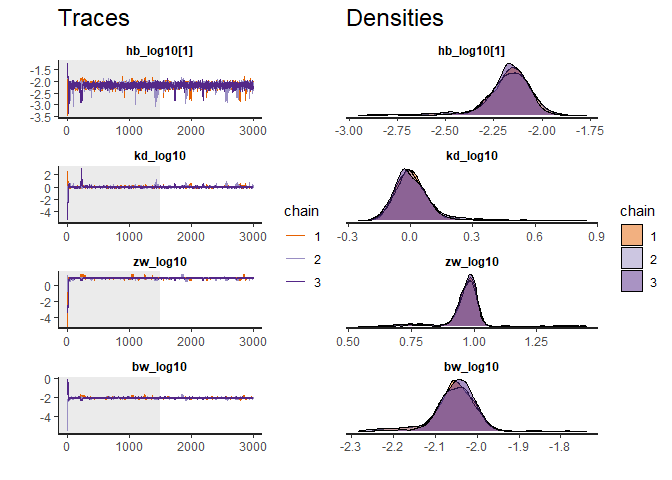

<!-- README.md is generated from README.Rmd. Please edit that file -->

# BeeGUTS

<!-- badges: start -->

[](https://lifecycle.r-lib.org/articles/stages.html#stable)
[](https://CRAN.R-project.org/package=BeeGUTS)
[](https://github.com/bgoussen/BeeGUTS/actions/workflows/R-CMD-check.yaml)
<!-- badges: end -->

The goal of BeeGUTS is to analyse the survival toxicity tests performed
for bee species. It can be used to fit a Toxicokinetic-Toxicodynamic
(TKTD) model adapted for bee standard studies (acute oral, acute
contact, and chronic oral studies). The TKTD model used is the General
Unified Threshold model of Survival (GUTS).

## Installation

You can install the released version of BeeGUTS from
[CRAN](https://CRAN.R-project.org) with:

``` r
install.packages("BeeGUTS")
```

And the development version from [GitHub](https://github.com/) with:

``` r
# install.packages("devtools")
devtools::install_github("bgoussen/BeeGUTS")
```

## Example

This is a basic example which shows you how to solve a common problem:

``` r
library(BeeGUTS)
#> BeeGUTS (Version 1.1.3, packaged on the: )
#> - For execution on a local, multicore CPU with excess RAM we recommend calling
#>       options(mc.cores = parallel::detectCores()-1)
#> - In addition to the functions provided by 'BeeGUTS', we recommend using the packages:
#>    - 'bayesplot' for posterior analysis, model checking, and MCMC diagnostics.
#>    - 'loo' for leave-one-out cross-validation (LOO) using Pareto smoothed
#>        importance sampling (PSIS), comparison of predictive errors between models, and
#>        widely applicable information criterion (WAIC).
file_location <- system.file("extdata", "betacyfluthrin_chronic_ug.txt", package = "BeeGUTS") # Load the path to one of the example file
lsData <- dataGUTS(file_location = file_location, test_type = 'Chronic_Oral', cstConcCal = FALSE) # Read the example file
plot(lsData) # Plot the data
#> [[1]]
```


``` r
fit <- fitBeeGUTS(lsData, modelType = "SD", nIter = 3000) # Fit a SD model. This can take some time...
#> Warning: Tail Effective Samples Size (ESS) is too low, indicating posterior variances and tail quantiles may be unreliable.
#> Running the chains for more iterations may help. See
#> https://mc-stan.org/misc/warnings.html#tail-ess
traceplot(fit) # Produce a diagnostic plot of the fit
```



``` r
plot(fit) # Plot the fit results
#> [[1]]
```


``` r
summary(fit) # Gives a summary of the results
#> Computing summary can take some time. Please be patient...Summary: 
#> 
#> Bayesian Inference performed with Stan.
#>  Model type: SD 
#>  Bee species: Honey_Bee 
#> 
#>  MCMC sampling setup (select with '$setupMCMC')
#>  Iterations: 3000 
#>  Warmup iterations: 1500 
#>  Thinning interval: 1 
#>  Number of chains: 3
#> 
#> Priors of the parameters (quantiles) (select with '$Qpriors'):
#> 
#>  parameters      median        Q2.5       Q97.5
#>          hb 8.32763e-03 1.09309e-04 6.34432e-01
#>          kd 2.62826e-03 1.17073e-06 5.90041e+00
#>          zw 8.24621e-03 1.19783e-06 5.67693e+01
#>          bw 1.84061e-03 1.69711e-06 1.99625e+00
#> 
#> Posteriors of the parameters (quantiles) (select with '$Qposteriors'):
#> 
#>  parameters      median        Q2.5       Q97.5
#>       hb[1] 6.88053e-03 2.53108e-03 1.00538e-02
#>  parameters      median        Q2.5       Q97.5
#>          kd 9.97012e-01 7.25191e-01 2.30604e+00
#>          zw 9.44638e+00 5.62942e+00 1.07292e+01
#>          bw 8.88840e-03 6.22759e-03 1.06406e-02
#> 
#> 
#>  Maximum Rhat computed (na.rm = TRUE): 1.007025 
#>  Minimum Bulk_ESS: 617 
#>  Minimum Tail_ESS: 295 
#>  Bulk_ESS and Tail_ESS are crude measures of effecting sampling size for
#>       bulk and tail quantities respectively. An ESS > 100 per chain can be
#>       considered as a good indicator. Rhat is an indicator of chains convergence.
#>       A Rhat <= 1.05 is a good indicator of convergence. For detail results,
#>       one can call 'rstan::monitor(YOUR_beeSurvFit_OBJECT$stanFit)
#> 
#>  EFSA Criteria (PPC, NRMSE, and SPPE) can be accessed via 'x$EFSA'
validation <- validate(fit, lsData) # produce a validation of the fit (here it uses the same dataset as calibration as an example, so not relevant…)
#> Note that computing can be quite long (several minutes).
#>   Tips: To reduce that time you can reduce Number of MCMC chains (default mcmc_size is set to 1000).
plot(validation) # plot the validation results
```


``` r
dataPredict <- data.frame(time = c(1:5, 1:15), conc = c(rep(5, 5), rep(15, 15)),  replicate = c(rep("rep1", 5), rep("rep3", 15))) # Prepare data for forwards prediction
prediction <- predict(fit, dataPredict) # Perform forwards prediction. At the moment, no concentration recalculation is performed in the forwards prediction. The concentrations are taken as in a chronic test
plot(prediction) # Plot of the prediction results
```


