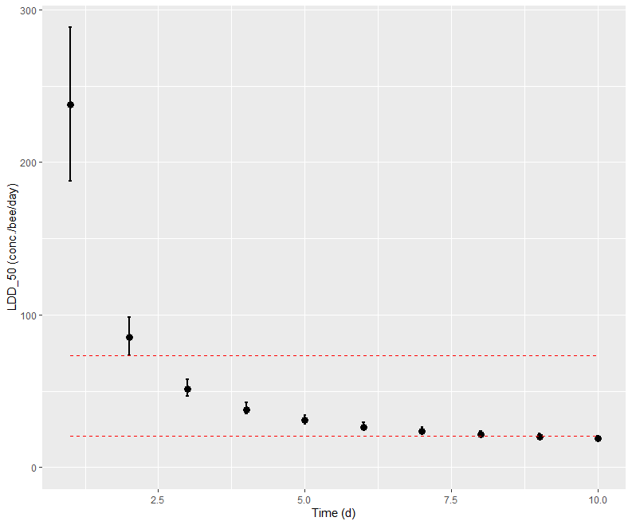

Short time of effect check
================
2024-10-17

Back to [home](./home.md)

Go to [dataset](./dataset_loading.md) explanation

Go to [model calibration](./calibration.md)

## Short time of effect calculations

This is a functionality that was introduced after teh publication of the
new EFSA guidance document for the risk assessment of pollinators 
[here](https://www.efsa.europa.eu/en/efsajournal/pub/3295).

The functionality is inspired by section 6.6 of the guidance document:
the function will produce a figure similar to what is shown in Figure 8 
of the aforementioned document.

Short time of effect happens if the initial exposure is the one that drives
most of the effect.

Identification of short time of effect is based on the results of a chornic
oral test via the comparison between the lethal daily dose for 50% of the
effect (LDD50) at day 2 and at day 10. According to the guidance document:
"If the LDD50 after 2 days and after 
10 days are significantly different or present a ratio > 3, it can be 
concluded that the exposure time plays an important role in the overall
expression of effect ..." [EFSA, 2023](https://www.efsa.europa.eu/en/efsajournal/pub/3295).

### Usage

The calculation can be done using the function `ShortTimeEffects` on the result of a 
previously calibrated model for both SD and IT death mechanism 
(see [model calibration](./calibration.md)).

```r
ste <- ShortTimeEffects(fitSD,
                        concRange = NULL,
                        fullcalculation=FALSE)

[[1]]

[[2]]
   time     ldd50 ldd50_q2p5 ldd50_q97p5
1     1 238.04778  187.64351   288.23599
2     2  85.07873   73.50135    98.19929
3     3  51.57933   46.63133    57.77604
4     4  38.02631   34.92836    42.23769
5     5  30.91324   28.56618    34.32836
6     6  26.54776   24.64148    29.32837
7     7  23.65527   21.94026    26.09114
8     8  21.58802   20.02446    23.82724
9     9  20.04263   18.57041    22.11080
10   10  18.84311   17.38564    20.76871

[[3]]
[1] "No fast expression of effects\n"
```



The function returns a graph and a table with the predicted LDD50 
value at different times. If the optional parameter if optional argument 
`fullcalculation` is set to `FALSE`, the graph will show only the 
values at day 2 and day 10: the minimum required for the assessment of
short time of effect.
If `fullcalculation=TRUE`, then the calculation of the LDD50 is done for all
days: from day 1 to day 10 (as Figure 8 of the guidance document).

The function also returns the message of the assessment as a string.

The optional parameter `concRange` is inherited from the function 
[`LCx`](./lc_x_calculation.md), that is called internally by
`ShortTimeEffects` and allows to define a concentration range. If a range is not
given, the default option is to use the maximum range of the data.

The number of concentration steps is controlled by the other optional argument
`nPoints`. If this argument is not present, the default is that there will be
at least 100 concentrations steps between the minimum and the maximum 
concentration.

As the LDD50 value at very early times can be significantly larger than
the range of concentrations in the experiment, even without the specifying 
the range, the function can extend the range for the calculation up to a
factor 5 (after showing a message on screen). If the calculation still
fails, then it is recommended to manually provide a range for the calculation.


[Back to top](#short-time-of-effect-check)

Back to [home](./home.md)
