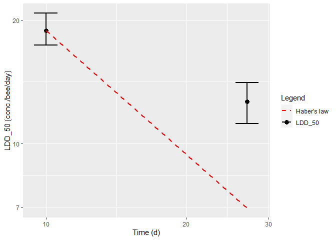

Time Reinforced Toxicity check
================
2024-04-26

Back to [home](./home.md)

Go to [dataset](./dataset_loading.md) explanation

Go to [model calibration](./calibration.md)

## Time Reinforced Toxicity calculations

The new EFSA guidance document for the risk assessment of pollinators 
[here](https://www.efsa.europa.eu/en/efsajournal/pub/3295) has changed the 
way risk for pollinators is assessed in Europe.

The first aspect that the new guidance document requires to check is the 
presence or not of Time Reinforced Toxicity (TRT). 
In short, TRT presence means that a prolonged exposure is proportionally
more detrimental than a short term exposure. The argument is treated in details
in Chapter 8 of the EFSA guidance document and in the Annex G of the 
relative supporting information document.

To determine the presence of TRT, GUTS models need to be used. However, the
analysis is simplified with respect to the full modelling cycle required for 
TKTD models (see e.g., EFSA, 2018).

In the pollinator guidance document, it is required only the calibration of a 
GUTS model on the results of a 10-day Chronic Oral test.

The check for TRT as described in the Chapter 8 of the guidance document has
been implemented in the `BeeGUTS` R package and can be performed on a
previously calibrated model for both SD and IT death mechanism 
(see [model calibration](./calibration.md)).

### Usage
The calculation can be done using the function `TRT`:

```r
trt <- TRT(fitSD)

No Time Reinforced Toxicity
[[1]]

[[2]]
  time    ldd50    lddhab ldd50_q2p5 ldd50_q97p5   trt
1   10 18.84009 18.840089   17.39067    20.76588    NA
2   27 12.65733  6.977811   11.18017    14.08607 FALSE
```


The function returns a plot that shows the value of the LDD50 at day 10 and 
its predicted value at day 27, together with a red dashed line that indicates
helps discriminate the presence of TRT or not: if the LDD50 at day 27 is below
the red line, TRT cannot be excluded.

The second object returned by the function is a table with the values to
generate the plot.


An additional argument that can be passed to the `TRT` function is `concRange`.
This argument might be needed as the funciton `TRT` calls internally 
[`LCx`](./lc_x_calculation.md) and it might happen that the default range is not
sufficient and needs to be eypanded.


[Back to top](#time-reinforced-toxicity-check)

Back to [home](./home.md)