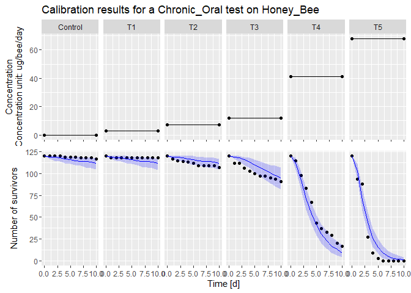
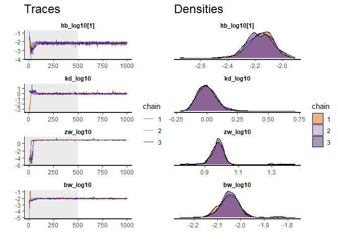
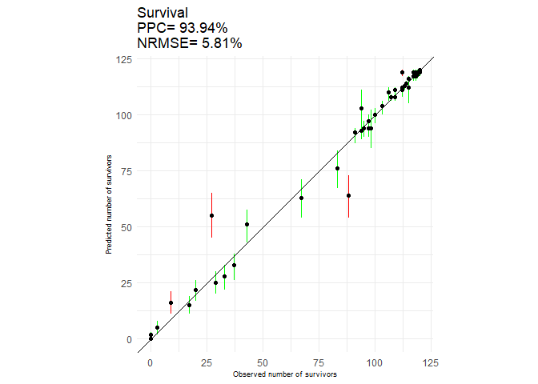

Model Calibration
================
2023-10-13

Back to [home](./home.md)

Go to [dataset](./dataset_loading.md) explanation

``` r
file1 = "./../inst/extdata/betacyfluthrin_chronic_ug.txt"
datacalCO <- dataGUTS(file_location = file1,
                      test_type = "Chronic_Oral",
                      bee_species = "Honey_Bee",
                      cstConcCal = FALSE)
```

## Calibration of the model

The calibration of the model is done using the
[rstan](https://cran.r-project.org/web/packages/rstan/) package, a R
interface for the [Stan](https://mc-stan.org/) software.

This is an extremely robust MCMC sampler for Bayesian. The cost of this
robustness can sometimes come at the expenses of the execution time,
especially in the case of non-constant exposure profiles.

- SD model
- IT model

## Example

    fitSD <- fitBeeGUTS(datacalCO, 
               modelType = "SD", 
               nIter = 1000,
               nChains = 3)

The results of the calibration can be explored by using the `summary`
function. This shows the parameter values and some diagnostics that Stan
outputs to assess if there have been problems with the MCMC (lack of
convergence, poor mixing, poor sampling)

``` r
summary(fitSD)
#> Computing summary can take some time. Please be patient...Summary: 
#> 
#> Bayesian Inference performed with Stan.
#>  Model type: SD 
#>  Bee species: Honey_Bee 
#> 
#>  MCMC sampling setup (select with '$setupMCMC')
#>  Iterations: 1000 
#>  Warmup iterations: 500 
#>  Thinning interval: 1 
#>  Number of chains: 3
#> 
#> Priors of the parameters (quantiles) (select with '$Qpriors'):
#> 
#>  parameters      median        Q2.5       Q97.5
#>          hb 8.32763e-03 1.09309e-04 6.34432e-01
#>          kd 2.62826e-03 1.17073e-06 5.90041e+00
#>          zw 8.24621e-03 1.19783e-06 5.67693e+01
#>          bw 1.84061e-03 1.69711e-06 1.99625e+00
#> 
#> Posteriors of the parameters (quantiles) (select with '$Qposteriors'):
#> 
#>  parameters      median        Q2.5       Q97.5
#>       hb[1] 6.94741e-03 4.41835e-03 1.03112e-02
#>  parameters      median        Q2.5       Q97.5
#>          kd 9.85368e-01 7.37670e-01 1.56720e+00
#>          zw 9.47747e+00 7.79556e+00 1.10353e+01
#>          bw 8.94660e-03 7.33115e-03 1.08605e-02
#> 
#> 
#>  Maximum Rhat computed (na.rm = TRUE): 1.023505 
#>  Minimum Bulk_ESS: 375 
#>  Minimum Tail_ESS: 230 
#>  Bulk_ESS and Tail_ESS are crude measures of effecting sampling size for
#>       bulk and tail quantities respectively. An ESS > 100 per chain can be
#>       considered as a good indicator. Rhat is an indicator of chains convergence.
#>       A Rhat <= 1.05 is a good indicator of convergence. For detail results,
#>       one can call 'rstan::monitor(YOUR_beeSurvFit_OBJECT$stanFit)
#> 
#>  EFSA Criteria (PPC, NRMSE, and SPPE) can be accessed via 'x$EFSA'
```

Again the results can be simply plotted using

``` r
plot(fitSD)
#> [[1]]
```

 The plotting
function actually returns a list, because in case of multiple datasets,
all fits are shown.

### Diagnostics

When dealing with MCMC in bayesian inference, it is important to assess
that the fit as converged to a sensible solutions. Besides reading the
bottom part of the output of hte `summary` function, it is possible to
look at the trace plot of the MCMC chains, to ensure that there was no
issue with the MCMC chains.

``` r
traceplot(fitSD)
```



In the figure it is possible to see how the traces are all well behaving
after the burn-in period (represented by the grey area), and that the 3
chains mixed well.

### Goodness of fit and EFSA criteria

In the Scientific Opinion on TKTD models, EFSA defined performance
criteria to judge a GUTS fit to survival data.

These checks can be shown by BeeGUTS with the function `criteriaCheck`,
which shows the values of the Posterior Predictve Check (PPC), the
NRMSE, and the SPPE

``` r
criteriaCheck(fitSD)
#> $percentPPC
#>       data      PPC
#> 1 Survival 93.93939
#> 
#> $percentNRMSE
#>       data   NRMSE
#> 1 Survival 5.81303
#> 
#> $SPPE
#> $SPPE[[1]]
#>    SurvivalTime Dataset Treatment NSurv simQ50 NSurvInit       SPPE
#> 11           10       1   Control   117    112       120  4.1666667
#> 22           10       1        T1   118    112       120  5.0000000
#> 33           10       1        T2   107    112       120 -4.1666667
#> 44           10       1        T3    91     95       120 -3.3333333
#> 55           10       1        T4    17      9       120  6.6666667
#> 66           10       1        T5     0      1       120 -0.8333333
```

The PPC can also be visualized.

``` r
plot( ppc(fitSD) )
```



[Back to top](#)
