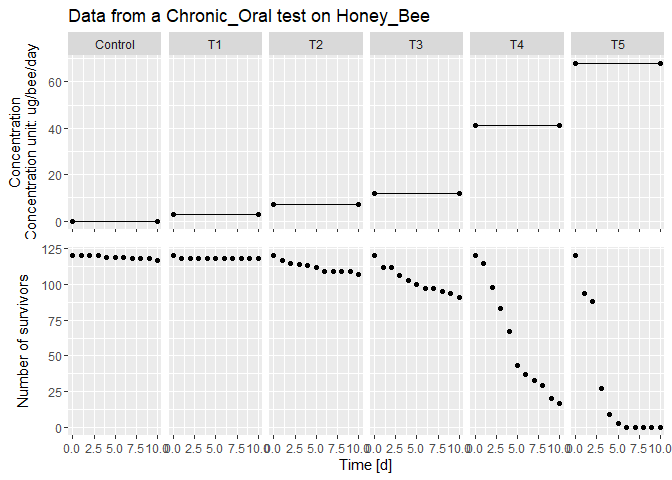
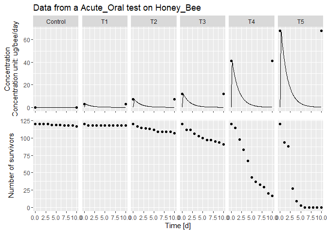
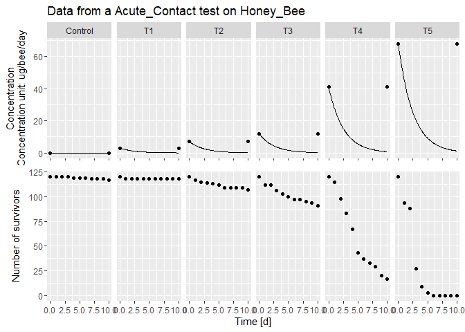

Datasets and Data read
================
2023-10-13

Back to [home](./home.md)

## Datasets

BeeGUTS can analyse the data from standard laboratory tests performed on
bee species.

They can be Chronic Oral, Acute Oral, and Acute Contact tests.

The survival data can be passed as simple text files (or excel tables),
after being consistently formatted.

### General structure

The general structure of the data file is shown below and it consists of
4 parts

- Metadata: It can contain information on the compound, species, type of
  test, etc. It is written in a human-readable format and it is skipped
  by the data reading function.
- Survival table: Table with the actual survival data. From here it
  starts the section of the file that will be read by the loading
  function. It has to start with the expression `Survival time [d]`.
  After this expression, there should not be any empty space between the
  rows of the file.
- Units: Right after the survival table, this line starts with
  `Concentration unit:`
- Exposure scenario: Gives the details of the exposure during the
  experiment. It starts with the expression `Concentration time [d]`.

<!-- -->

    Beta cyflumethrin chronic 479053

    All concentrations in ug/bee/day

    Survival time [d]   Control T1  T2  T3  T4  T5
    0   120 120 120 120 120 120
    1   120 118 117 112 115 94
    2   120 118 115 112 98  88
    3   120 118 114 106 83  27
    4   119 118 113 103 67  9
    5   119 118 112 100 43  3
    6   119 118 109 97  37  0
    7   118 118 109 97  33  0
    8   118 118 109 95  29  0
    9   118 118 109 94  20  0
    10  117 118 107 91  17  0
    Concentration unit: ug/bee/day
    Concentration time [d]  Control T1  T2  T3  T4  T5
    0   0   3   7   12  41  68
    10  0   3   7   12  41  68

### Chronic Oral

The chronic oral tests are dietary tests, usually 10 days long, where
the bee is fed contaminated food with a constant concentration of the
compound. An example file is the one shown in the previous section.

### Acute Oral

Acute Oral tests are shorter tests in which the bee is first starved and
then fed contaminated food for few hours and then again clean food till
the end of the test. For this reason the exposure has a more complex
time dependency.

In BeeGUTS this is automatically taken into account and in the Exposure
section of the dataset is enough to simply give the value of the maximum
concentration at time 0.

To rest of the calculations will be done by the data reading function
once all the parameters related to the test will be passed (see below).

### Acute Contact

Acute contact tests are tests in which a drop of contaminated liquid is
placed on the back of the bee.

Because of the …, in this case there is a non-constant evolution of the
exposure profile.

As for the acute oral test, also here is sufficient to give only the
maximum value of the exposure and the software will reconstruct an
accurate full time-dependent profile.

*Add short explanation about the time dependency of the exposure*

## Load the datasets

Loading of the dataset is done with the function

`dataGUTS(...)`

(for the complete details see explanation text in [source
code](./../R/readData.R))

This function takes the following arguments:

- `file_location`: List of Locations of text files containing the name
  and path of the data file (if more than one file, use
  `c(file1, file2)`)
- `test_type`: to be chosen between “Chronic_Oral”, “Acute_Oral”,
  “Acute_Contact” The test type has to be explicited for every dataset
  (if two datasets are passed, this argument has to receive an array of
  two test types using `c(type1, type2)`)
- `bee_species`: to be chosen between “Honey_Bee”, “Bumble_Bee”,
  “Osmia_bicornis”. Species cannot be mixed, only one species at the
  time is allowed. Default species is “Honey_Bee”. It is possible to
  introduce a “User_Bee” if the following parameters are defined:
  - stomach release rate (1/d) `k_sr` (for acute oral tests - 0.625 1/d
    for Honey Bee)
  - duration of exposure in days for the acute oral tests (d) `cTime`
    (0.25 d for Honey Bee)
  - contact availability rate (1/d) `k_ca` (for acute contact tests -
    0.4 1/d for Honey Bee)
  - feeding rate `f_rate` (for chronic tests)

When reading in chronic oral data, the argument `cstConcCal` should also
be specified.

- `cstConcCal=TRUE` if the concentration units are in mg/kg (so
  concentration in food). This argument ensures the conversion in units
  of µg/bee/day. If the bee species is not “Honey_bee”, `f_rate` must be
  specified (value of 25 mg/bee/day for Honey bee).
- `cstConcCal=FALSE` if the concentration units are already set as
  µg/bee/day.

## Examples

Below a list of examples is reported

### Read Chronic Oral

``` r
file1 = "./../inst/extdata/betacyfluthrin_chronic_ug.txt"
datacalCO <- dataGUTS(file_location = file1,
                    test_type = "Chronic_Oral",
                    bee_species = "Honey_Bee",
                    cstConcCal = FALSE)
```

The dataset can then simply be plotted with

``` r
plot(datacalCO)
#> [[1]]
```



As expected, the concentration profile (solid black line) is a constant
exposure, that interpolates the points given in the data file (black
circles)

### Read Acute Oral

For simplicity, always the same data file is used for the example.

``` r
datacalAO <- dataGUTS(file_location = file1,
                    test_type = "Acute_Oral",
                    bee_species = "Honey_Bee")
```

The dataset can then simply be plotted with

``` r
plot(datacalAO)
#> [[1]]
```



In this case the exposure profile (given by the concentration in the
honey stomach of the bee) is made of two parts. A rising part that lasts
`cTime` days where the maximum concentration is reached, and then a
second part where the concentration declines exponentially due to the
bee feeding uncontaminated food. The exponential decay is determined by
the constant `k_sr` that for Honey Bees has a default value of 0.625
1/d.

### Read Acute Contact

For simplicity, always the same data file is used for the example.

``` r
datacalAC <- dataGUTS(file_location = file1,
                    test_type = "Acute_Contact",
                    bee_species = "Honey_Bee")
```

The dataset can then simply be plotted with

``` r
plot(datacalAC)
#> [[1]]
```



In this case the exposure profile is an exponentially decaying function
determined by the contact availability constant `k_ca` that for Honey
Bees is set to a default value of 0.4 1/d.

[Back to top](#datasets-and-data-read)

Back to [home](./home.md)
