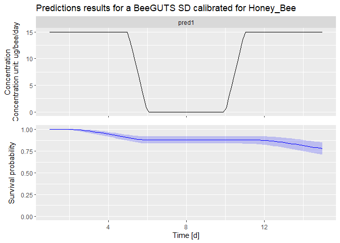

Model predictions
================
2024-10-17

Back to [home](./home.md)

## Model predictions

It is possible also to predict the survival probability for an arbitrary
exposure profile. In the example below, we can create an exposure
profile with a time variable concentration and predict the effect on the
survival probability.

The prediction is returned with the 95% confidence intervals.

``` r
dataPredict <- data.frame(time = c(1:15),
                          conc = c(rep(15,5), rep(0,5), rep(15,5)),
                          replicate = c(rep("pred1", 15)))


pred_res <- predict(fitSD, dataPredict)

plot(pred_res)
```




This function has been improved for a better handling of the background
mortality. However, to better work with the background mortality, the 
function `predict2` was introduced.

Beside the standard arguments of the fit object, and the exposure dataframe, 
the argument `userhb_value` was introduced. This argument can take 1 or 2 value
(if they need to be in an array). If only one value is given, then that is the 
value of background mortality rate that will be used. When two value are
provided, the first is the background mortality rate, the second one is its
approximate desired 95% upper-limit. This way a distribution of background
mortality can be simulated.

The used can also decide instead to use directly the background mortality of the
original calibration object, by setting the argument `calib_hb=TRUE` (using also
`ndatahb` in case the calibration was done on multiple datasets).

``` r
dataPredict <- data.frame(time = c(1:15),
                          conc = c(rep(15,5), rep(0,5), rep(15,5)),
                          replicate = c(rep("pred1", 15)))


pred_res <- predict(fitSD, dataPredict, 
                    userhb_value = c(0.01,0.025))

plot(pred_res)
```


[Back to top](#model-predictions)

Back to [home](./home.md)

