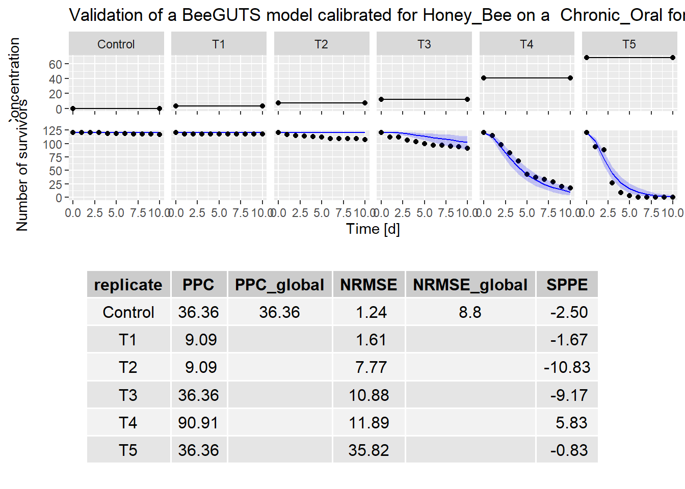

Model Validation
================
2023-10-13

Back to [home](./home.md)

Go to [dataset](./dataset_loading.md) explanation

Go instead to [calibration](./calibration.md)

## Load validation data and run validation

Data for the validation can be loaded in the same way as done
[here](./dataset_loading.html). For simplicity. we are going to use the
same Chronic Oral dataset used for the calibration

``` r
file1 = "./../inst/extdata/betacyfluthrin_chronic_ug.txt"
dataval <- dataGUTS(file_location = file1,
                      test_type = "Chronic_Oral",
                      bee_species = "Honey_Bee",
                      cstConcCal = FALSE)


valres <- validate(object = fitSD,
                   dataValidate = dataval)
#> Note that computing can be quite long (several minutes).
#>   Tips: To reduce that time you can reduce Number of MCMC chains (default mcmc_size is set to 1000).
plot(valres)
```



The validation results can look slightly off as the background mortality
is not being refitted to the new dataset, but simply assumed to be 0
(this will be changed in the future).

The criteria to assess the validation are reported in the table below
the plot and can be compared to the criteria defined by EFSA.

[Back to top](#model-validation)

Back to [home](./home.md)