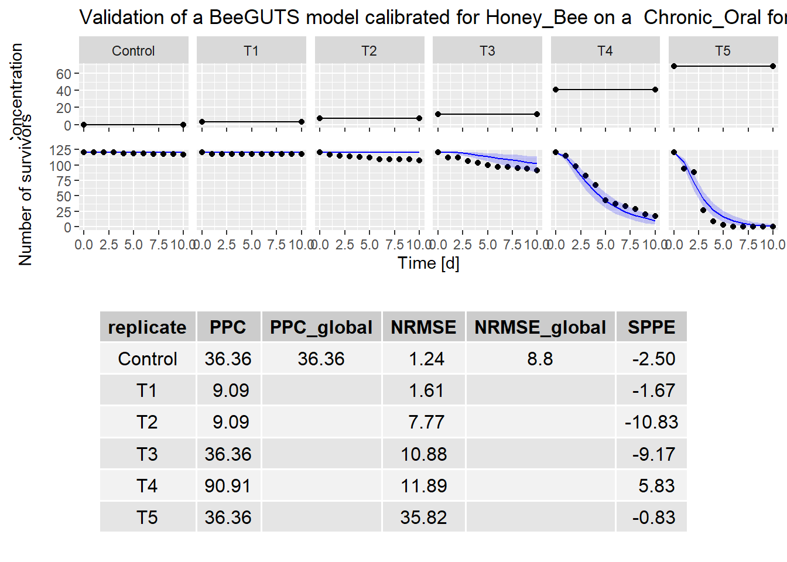

Model Validation
================
2024-10-17

Back to [home](./home.md)

Go to [dataset](./dataset_loading.md) explanation

Go instead to [calibration](./calibration.md)

## Load validation data and run validation

Data for the validation can be loaded in the same way as done
[here](./dataset_loading.html). For simplicity. we are going to use the
same Chronic Oral dataset used for the calibration.

Compared to previous versions of the package, the validation function includes
now the argument `fithb`. If set to TRUE, the control data of the validation
experiment can be used to refit the background mortality parameter (`hb`) and 
to avoid an artificial worsening of the model performance.


The results of this fit can be then accessed through the attribute `hbfit` of
the validation object, and they are summarized in the output of the validation
function.

``` r
file1 = "./../inst/extdata/betacyfluthrin_chronic_ug.txt"
dataval <- dataGUTS(file_location = file1,
                      test_type = "Chronic_Oral",
                      bee_species = "Honey_Bee",
                      cstConcCal = FALSE)


valres <- validate(object = fitSD,
                   dataValidate = dataval,
                   fithb = TRUE)
#> Note that computing can be quite long (several minutes).
#>   Tips: To reduce that time you can reduce Number of MCMC chains (default mcmc_size is set to 1000).
plot(valres)
```




The criteria to assess the validation are reported in the table below
the plot and can be compared to the criteria defined by EFSA.

[Back to top](#model-validation)

Back to [home](./home.md)
